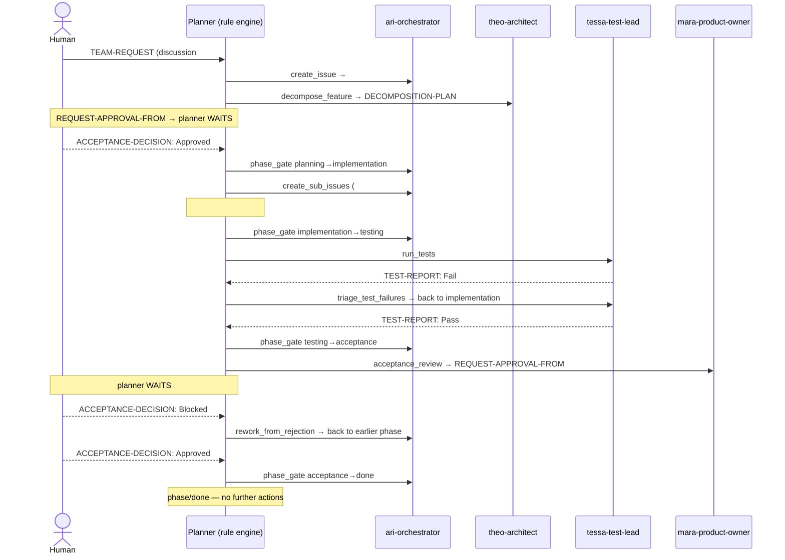

# SIMULATION: "Add a Login Feature" — end-to-end dry-run

**Date:** 2026-05-29
**Mode:** dry-run, fixture-driven — **no GitHub mutations**.
**Request:** *"Add a login feature (email/password + OAuth) to my app."*

This walkthrough exercises the full phase-gated lifecycle on a fresh request,
from a `TEAM-REQUEST` discussion to a closed (`phase/done`) epic, capturing every
planner decision. It is reproducible offline via the fixture bridge.

---

## Step 1 — State cleanup (read-only / simulated)

Per the safety constraints, **no live issues or discussions were closed.** The
sandbox currently holds **30 open issues** (`#92–#171`) and **5 open
discussions** (`#2, #56, #57, #74, #114`). A real reset *would* post a signed
`CLOSURE-REASON: Repository reset for fresh simulation.` on each and close it —
but the simulation runs entirely against a synthetic fixture, so closing shared
infrastructure was neither necessary nor performed.

## Step 2 — Fresh fixture

`scripts/build_fresh_fixture.py` writes `/tmp/fresh_state.json`: one Discussion
with `TEAM-REQUEST: Add a login feature (email/password + OAuth) to my app.`,
zero issues, zero PRs.

```bash
python3 scripts/build_fresh_fixture.py          # -> /tmp/fresh_state.json
python3 scripts/run_planner.py --fixture /tmp/fresh_state.json --mode multi
```

(`--fixture` was added to `run_planner.py` for this simulation: it loads a JSON
state snapshot instead of calling `gh`, so the whole run is offline and
side-effect-free.)

## Step 3 — Dry-run output (first step)

```
🚀 Planner mode=MULTI | DRY-RUN (safe) | fixture=/tmp/fresh_state.json
📂 Loading fixture state (offline)...
✅ 0 PRs, 0 issues, 1 discussions
🔍 Analysing problems...
✅ 1 problem(s) detected
   - P1 TEAM_REQUEST_UNPROCESSED on discussion #1
✅ Plan built: 1 step(s) (mode: multi)
📝 [dry] ari-orchestrator | create_issue | discussion#1 | ok
✅ Dry-run completed (no mutations).
```

---

## Narrative walkthrough

The fixture was evolved stage-by-stage to mirror what executing each step (plus
the corresponding agent/human action) would produce; the planner was re-run at
every stage. The deterministic rule engine drove each transition:

1. **Bootstrap (S0):** a `TEAM-REQUEST` discussion with no issue →
   `TEAM_REQUEST_UNPROCESSED` → **ari** opens issue `#100`.
2. **Planning (S1–S2):** `#100` is triaged `epic` + `phase/planning`. With no
   plan yet, `EPIC_UNDECOMPOSED` → **theo (Architect)** runs `decompose_feature`.
   A design debate (`ARGUMENT`/`COUNTER-PROPOSAL`) is in progress but still
   inside the resolution timeout, so the planner does not force a resolution.
3. **Human wait #1 (S3):** consensus is reached, a `DECOMPOSITION-PLAN` is
   posted, and `REQUEST-APPROVAL-FROM: @product-owner` is raised. The planning
   gate requires `ACCEPTANCE-DECISION: Approved`; `SUBTASKS_NOT_CREATED` is
   suppressed in the planning phase. **Result: the planner waits** — no action.
4. **Gate → implementation (S4):** the human posts `ACCEPTANCE-DECISION:
   Approved` → `PHASE_GATE_READY` → **ari** runs `phase_gate`
   (`planning → implementation`).
5. **Decompose into sub-issues (S5):** in implementation with a plan and no
   children, `SUBTASKS_NOT_CREATED` → **ari** runs `create_sub_issues`.
6. **Dependency blocking (S6):** sub-issues `#101` (email/password) and `#102`
   (OAuth, `Depends on: #101`) exist. `#102` raises `BLOCKED_BY_DEPENDENCY` and
   the planner **withholds all work on it**, triaging only the unblocked `#101`.
   (Actual code implementation of sub-tasks is performed by the core
   `implement_issue` loop, outside this orchestration planner.)
7. **Gate → testing (S7):** once both children are closed with approving
   reviews (Definition of Done met), `PHASE_GATE_READY` →
   `implementation → testing`.
8. **Testing (S8):** `phase/testing` with no report → `TESTING_REQUIRED` →
   **tessa (Test Lead)** runs `run_tests`.
9. **Test-failure rework (S9):** `TEST-REPORT: Fail` → `TESTING_FAILED` →
   **tessa** runs `triage_test_failures` — files `bug` sub-issues and routes
   `testing → implementation`. The gate is blocked while the latest report is
   Fail.
10. **Gate → acceptance (S10):** after the fix, `TEST-REPORT: Pass` (latest) →
    `PHASE_GATE_READY` → `testing → acceptance`.
11. **Human wait #2 (S11):** `phase/acceptance` with no request →
    `ACCEPTANCE_REQUIRED` → **mara (Product Owner)** runs `acceptance_review`,
    posting `REQUEST-APPROVAL-FROM`. The planner then waits for the human.
12. **Acceptance-rejection rework (S12):** the human posts `ACCEPTANCE-DECISION:
    Blocked (reason: password reset flow missing)` → `ACCEPTANCE_BLOCKED` →
    **ari** runs `rework_from_rejection`, routing back to the right phase.
13. **Gate → done (S13):** after rework + a fresh `ACCEPTANCE-DECISION:
    Approved` (latest decision), `PHASE_GATE_READY` → `acceptance → done`.
14. **Terminal (S14):** `phase/done` — the planner produces **no further
    actions**.

---

## Planner step table

| # | Stage | Phase | Driving problem | Action | Persona | Target |
|---|-------|-------|-----------------|--------|---------|--------|
| 0 | fresh request | — | `TEAM_REQUEST_UNPROCESSED` | `create_issue` | ari-orchestrator | discussion #1 |
| 1 | triaged epic | planning | `EPIC_UNDECOMPOSED` | `decompose_feature` | theo-architect | #100 |
| 2 | debate active | planning | `EPIC_UNDECOMPOSED` | `decompose_feature` | theo-architect | #100 |
| 3 | approval requested | planning | (gate not ready) | **— human wait —** | — | #100 |
| 4 | human approved | planning | `PHASE_GATE_READY` | `phase_gate` → implementation | ari-orchestrator | #100 |
| 5 | plan, no children | implementation | `SUBTASKS_NOT_CREATED` | `create_sub_issues` | ari-orchestrator | #100 |
| 6 | sub-issues + dep | implementation | `BLOCKED_BY_DEPENDENCY` (#102) | triage unblocked #101 | ari-orchestrator | #101 |
| 7 | children done | implementation | `PHASE_GATE_READY` | `phase_gate` → testing | ari-orchestrator | #100 |
| 8 | no report | testing | `TESTING_REQUIRED` | `run_tests` | tessa-test-lead | #100 |
| 9 | tests fail | testing | `TESTING_FAILED` | `triage_test_failures` → implementation | tessa-test-lead | #100 |
| 10 | tests pass | testing | `PHASE_GATE_READY` | `phase_gate` → acceptance | ari-orchestrator | #100 |
| 11 | acceptance | acceptance | `ACCEPTANCE_REQUIRED` | `acceptance_review` | mara-product-owner | #100 |
| 12 | human blocked | acceptance | `ACCEPTANCE_BLOCKED` | `rework_from_rejection` | ari-orchestrator | #100 |
| 13 | reworked + approved | acceptance | `PHASE_GATE_READY` | `phase_gate` → done | ari-orchestrator | #100 |
| 14 | done | done | — | **— terminal —** | — | #100 |

---

## Sequence diagram



---

## Debug log sample

Each step is written to `logs/YYYY-MM-DD/<run_id>-step-<NNNN>.json`:

```json
{
  "timestamp": "2026-05-29T04:09:15.669130+00:00",
  "run_id": "20260529-040915-668661",
  "mode": "multi",
  "step_index": 2,
  "persona": "ari-orchestrator",
  "action": "create_issue",
  "target": { "type": "discussion", "number": 1 },
  "prompt_body": "---\nPersona: ari-orchestrator\nRole: AI Orchestrator\n…",
  "gh_command": "gh issue create --title Add a login feature … --repo …",
  "gh_output": "",
  "success": true,
  "error": null,
  "dry_run": true
}
```

Every entry carries `persona`, `action`, `target`, and `dry_run` as required.

---

## Verification

- **Human wait points work.** At S3 (planning approval) and S11→S12 (acceptance
  sign-off) the planner produced **no advancing action** until the human posted
  the required `ACCEPTANCE-DECISION`. The planning/acceptance gates only fire on
  `Approved`.
- **Phase transitions are correct and ordered.** Every gate
  (`planning→implementation→testing→acceptance→done`) fired only when its exit
  criteria were met; out-of-phase work was suppressed (e.g. `EPIC_UNDECOMPOSED`
  and `SUBTASKS_NOT_CREATED` did not act during testing/acceptance).
- **Both rework loops close.** A failing test (S9) and a human rejection (S12)
  each routed the epic back to an earlier phase and the loop resumed, reaching
  `phase/done` after the fixes.
- **Dependency blocking holds.** `#102` (`Depends on: #101`) received no work
  while `#101` was open.

### Honest scope notes

- **No live mutations.** Cleanup was simulated; the run is fixture-only.
- **Orchestration vs. implementation.** This planner orchestrates the lifecycle
  (gates, decomposition, testing/acceptance, rework). Writing the actual login
  code and opening PRs for each sub-task is the job of the core `implement_issue`
  loop, which is out of scope for this dry-run.
- **Fixture evolution is hand-authored.** Each stage's state was constructed to
  represent the expected result of the prior step; the planner's *decisions* are
  the system's real output, but the agent/human *executions* between steps were
  simulated.
