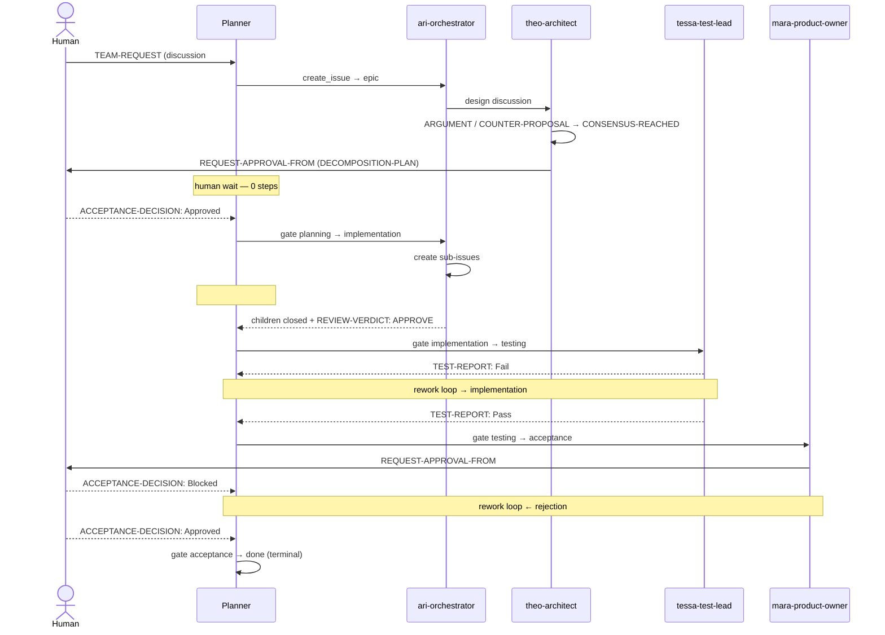

# SIMULATION: "Add a Login Feature" — pure dry-run (no live changes)

**Date:** 2026-05-29
**Mode:** dry-run, fixture-driven — **no GitHub mutations of any kind.**
**Request:** *"Add a login feature (email/password + OAuth) to my app."*

This walkthrough exercises the full phase-gated feature lifecycle on a fresh
request — from a `TEAM-REQUEST` discussion to a closed (`phase/done`) epic — by
driving the **real planner in the loop** over an evolving local fixture. No
`gh issue` / `gh pr` mutating call was run, no branch was pushed, and nothing
was fetched from `origin`. Every state transition was read from a JSON fixture
this repo builds itself.

> **Reproduce offline:**
> ```bash
> python3 scripts/build_login_fixture.py                 # -> /tmp/login_fixture.json
> python3 scripts/run_planner.py --fixture /tmp/login_fixture.json --mode multi
> python3 scripts/simulate_login_dry_run.py              # full lifecycle -> /tmp/login_simulation.log
> ```

---

## Step 1 — Initial fixture

`scripts/build_login_fixture.py` writes `/tmp/login_fixture.json`: one Discussion
carrying `TEAM-REQUEST: Add a login feature (email/password + OAuth) to my app.`,
**zero** open issues, **zero** PRs, plus minimal repo metadata
(`owner=ci4me`, `name=ai-erp-foundation`, `defaultBranch=main`). No remote state
is consulted — the planner reads this file instead of calling `gh`.

## Step 2 — Planner, multi mode (first step)

```bash
python3 scripts/run_planner.py --fixture /tmp/login_fixture.json --mode multi
```

```
🚀 Planner mode=MULTI | DRY-RUN (safe) | fixture=/tmp/login_fixture.json
📂 Loading fixture state (offline)...
✅ 0 PRs, 0 issues, 1 discussions
🔍 Analysing problems...
✅ 1 problem(s) detected
   - P1 TEAM_REQUEST_UNPROCESSED on discussion #1
🏗️  Building plan...
✅ Plan built: 1 step(s) (mode: multi)
🚀 Executing plan...
── Executing 1 step(s) [DRY-RUN] | run_id=...
📝 [dry] ari-orchestrator         | create_issue     | discussion#1   | ok
✅ Dry-run completed (no mutations).
```

The planner detects the unprocessed request and plans a single action:
`ari-orchestrator` would open an issue from discussion #1. Nothing executes.

## Step 3 — Iterative, planner-in-the-loop evolution

`scripts/simulate_login_dry_run.py` evolves the fixture one stage at a time.
For each stage it (1) injects the comment/marker an AI persona or the human
would post, (2) writes `/tmp/login_fixture_step<NN>.json`, (3) re-runs the
**real** `run_planner.py --fixture ... --mode multi` as a subprocess, and
(4) appends the planner's full output to `/tmp/login_simulation.log`. The
`marker` column below is the signal posted to *enter* that stage.

### Step table

| # | Phase | Marker posted | Planner's next action | Persona | Stage |
|---|-------|---------------|-----------------------|---------|-------|
| 0 | — | `TEAM-REQUEST:` | `create_issue` | `ari-orchestrator` | fresh request (discussion #1) |
| 1 | planning | `epic` triage label | `comment_issue` | `theo-architect` | issue #100 opened + triaged |
| 2 | planning | `ARGUMENT:` / `COUNTER-PROPOSAL:` | `comment_issue` | `theo-architect` | design debate (within timeout) |
| 3 | planning | `CONSENSUS-REACHED:` / `REQUEST-APPROVAL-FROM:` | **— (human wait)** | — | consensus + plan + approval requested |
| 4 | planning | `ACCEPTANCE-DECISION: Approved` | `comment_issue` | `ari-orchestrator` | human approved → gate |
| 5 | implementation | `PHASE-CHANGE: planning→implementation` | `comment_issue` | `ari-orchestrator` | moved to implementation |
| 6 | implementation | `SUB-TASK:` (children created) | **— (blocked/wait)** | — | #101,#102 (#102 blocked by #101) |
| 7 | implementation | `REVIEW-VERDICT: APPROVE` | `comment_issue` | `ari-orchestrator` | sub-tasks closed → gate |
| 8 | testing | `PHASE-CHANGE: implementation→testing` | `comment_issue` | `tessa-test-lead` | testing, no report yet |
| 9 | testing | `TEST-REPORT: Fail` | `comment_issue` | `tessa-test-lead` | **rework loop** → implementation |
| 10 | testing | `TEST-REPORT: Pass` | `comment_issue` | `ari-orchestrator` | tests green → gate |
| 11 | acceptance | `PHASE-CHANGE: testing→acceptance` | `comment_issue` | `mara-product-owner` | request human sign-off |
| 12 | acceptance | `ACCEPTANCE-DECISION: Blocked` | `comment_issue` | `ari-orchestrator` | **rework loop** ← rejection |
| 13 | acceptance | `ACCEPTANCE-DECISION: Approved` | `comment_issue` | `ari-orchestrator` | reworked + re-approved → gate |
| 14 | done | `PHASE-CHANGE: acceptance→done` | **— (terminal)** | — | `phase/done` — lifecycle complete |

### Selected planner excerpts

**Step 3 — human wait point** (consensus reached, approval requested, *no action
emitted* until the human responds):

```
✅ 1 problem(s) detected
   - P3 SUBTASKS_NOT_CREATED on issue #100
✅ Plan built: 0 step(s) (mode: multi)
── Executing 0 step(s) [DRY-RUN]
✅ Dry-run completed (no mutations).
```

**Step 9 — test-failure rework** (planner routes back to the test lead):

```
✅ 2 problem(s) detected
   - P2 TESTING_FAILED on issue #100
   - P3 SUBTASKS_NOT_CREATED on issue #100
✅ Plan built: 1 step(s) (mode: multi)
📝 [dry] tessa-test-lead          | comment_issue    | issue#100      | ok
```

**Step 14 — terminal** (`phase/done`; the planner emits no further lifecycle
action):

```
✅ Plan built: 0 step(s) (mode: multi)
── Executing 0 step(s) [DRY-RUN]
✅ Dry-run completed (no mutations).
```

## Step 4 — Wait points & phase transitions confirmed

- **Human wait points held.** At Step 3 (`REQUEST-APPROVAL-FROM` pending) and
  Step 6 (`#102` dependency-blocked by `#101`), the planner produced **0 steps**
  — it does not invent the human's approval, nor act on a dependency-blocked
  child. Forward motion resumed only after `ACCEPTANCE-DECISION: Approved`
  (Step 4) and after the children closed with `REVIEW-VERDICT: APPROVE`
  (Step 7).
- **Phase transitions were correct & ordered:** `planning → implementation →
  testing → acceptance → done`, each gated by its required marker
  (`ACCEPTANCE-DECISION: Approved`, `REVIEW-VERDICT: APPROVE`, `TEST-REPORT:
  Pass`).
- **Both rework loops fired:** `TEST-REPORT: Fail` (Step 9) routed back to the
  test lead, and `ACCEPTANCE-DECISION: Blocked` (Step 12) routed the epic back
  for rework before the re-approval at Step 13.
- **Persona hand-offs were sensible:** orchestration/gates → `ari-orchestrator`,
  design → `theo-architect`, testing → `tessa-test-lead`, acceptance →
  `mara-product-owner`.

## Flow



---

## Defects found by the dry-run (and fixed)

Running the simulation against the live tooling surfaced **four real defects**
in the loop machinery. Per the established practice (cf. commit `0374efa`,
"3 bugs found by the login test"), these were fixed; the simulation report and
the fixes ship together.

1. **`next_prompt` facade missing re-exports.** The "G3 facade" refactor left
   `gather_repo_state`, `render_prompt`, `_context_for_probe`, `_gh`, and
   `_load_pr_details` un-exported from `simulation/tools/next_prompt.py`, so the
   fixture renderer (`run_next_prompt_from_fixture`) raised `AttributeError`.
   *Fix:* re-export them from the facade.
2. **Monkeypatch hit the wrong namespace.** `run_next_prompt_from_fixture` and
   two tests patched `next_prompt._gh` / `_load_pr_details`, but those functions
   were extracted into `next_prompt_legacy` and resolve those names in *that*
   module's namespace — so the fixture shim was inert and the loop would call
   real `gh`. *Fix:* install the shim on `next_prompt_legacy`.
3. **The validity filter silently skipped CI/config-only PRs.** `item_validator`
   classified any PR with no *source-code* file as "note-only" and dropped it
   from the loop. Because `CODE_EXTENSIONS` lists only programming languages,
   a `.github/workflows/*.yml` or other config/infra-only PR — a real, mergeable
   change — was never acted on. *Fix:* a dedicated `ACTIONABLE_EXTENSIONS` set
   (code **+** CI/config/infra/build/web) for the note-only check; documentation
   (`.md`/`.rst`/`.txt`) stays note-only by design.
4. **Stale release-gate test fixture.** A release-gate test used a docs-only PR,
   which (correctly, per #3) is now skipped. *Fix:* the fixture uses an
   actionable PR so it exercises the gate it is meant to test.

## Step 5 — Final checks

```bash
python3 -m pytest -q                       # 255 passed
python3 simulation/tools/full_audit.py     # 🎉 Audit passed.
```

Both are green. No live issue, PR, branch, or remote was created or modified at
any point in this simulation.
